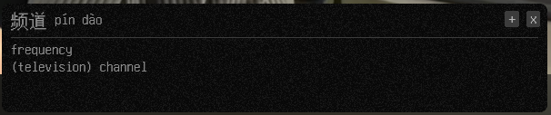
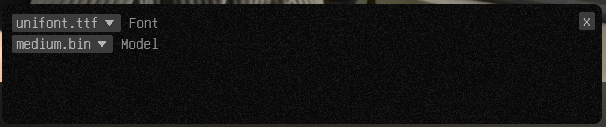

# lange
- This is a language learning tool for transcribing Chinese audio from podcasts/videos into written form
- The Chinese characters shown are clickable, and will bring up a dictionary
- Click + icon or right click the characters to add to internal list
- Clicking Export will automatically generate an anki deck from your words (if word is already known anki will skip adding it)

## License
MIT [LICENSE](LICENSE)

## Details
- Currently only supports wayland hyprland/niri/sway/i3
- Windows support planned in the future

## Screenshots
### Main Page

### Dictionary Mode

### Settings

## Usage and Installation
1. Download source code and open terminal in directory
2. Build binary by running: cargo build --release
3. Run first time will download required assets, after settings can be modified
